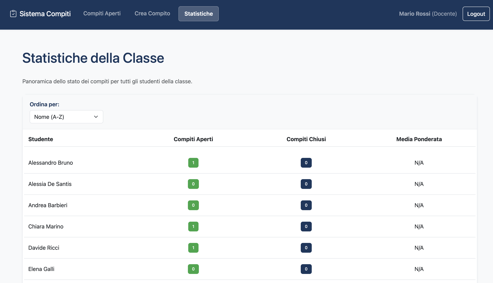

[](https://classroom.github.com/a/F9jR7G97)

# Exam #2: "Compiti"

## Student: s339129 Bonamico Carola

## React Client Application Routes

- `/login` — Authentication page (public)
- `/` — Redirects to `/assignments` if authenticated, or to `/login` if not authenticated
- `/assignments` — Open assignments list for answer submission (students) or evaluation (teachers) (protected)
- `/assignments/new` — Create new assignment with live constraint validation (teachers only) (protected)
- `/statistics` — Student statistics with sortable data (teachers only) (protected)
- `/my/scores` — Student's closed assignments and weighted average (students only) (protected)
- `*` — 404 Not Found page for any unrecognized route

## APIs

Hereafter, we report the designed HTTP APIs, also implemented in the project.

### __Login__

URL: `/api/sessions`

HTTP Method: POST.

Description: Login, create user session.

Request body:
```json
{
  "username": "mario.rossi@polito.it",
  "password": "password123"
}
```

Response: `200 OK` (success), `401 Unauthorized` (invalid credentials), or `500 Internal Server Error` (generic error). In case of success, returns user data in JSON format (see below). Else, returns an error message.

Response body:
```json
{
  "id": 1,
  "username": "mario.rossi@polito.it",
  "name": "Mario Rossi",
  "role": "teacher"
}
```

### __Get current user__

URL: `/api/sessions/current`

HTTP Method: GET.

Description: Get authenticated user.

Response: `200 OK` (success), `401 Unauthorized` (not authenticated), or `500 Internal Server Error` (generic error).

Response body:
```json
{
  "id": 1,
  "username": "mario.rossi@polito.it",
  "name": "Mario Rossi",
  "role": "teacher"
}
```

### __Logout__

URL: `/api/sessions/current`

HTTP Method: DELETE.

Description: Logout.

Response: `200 OK` (success) or `500 Internal Server Error` (generic error).

Response body: __None__

### __List all students__

URL: `/api/students`

HTTP Method: GET.

Description: Retrieve all students.

Response: `200 OK` (success), `401 Unauthorized` (not authenticated), or `500 Internal Server Error` (generic error). In case of success, returns an array of students in JSON format (see below). Else, returns an error message.

Response body:
```json
[
  {
    "id": 3,
    "name": "Giulia Bianchi",
    "email": "giulia.bianchi@studenti.polito.it",
    "role": "student"
  },
  {
    "id": 4,
    "name": "Marco Ferrari",
    "email": "marco.ferrari@studenti.polito.it",
    "role": "student"
  }
]
```

### __Get open assignments__

URL: `/api/assignments/open`

HTTP Method: GET.

Description: Get open assignments filtered by user role.

Response: `200 OK` (success), `401 Unauthorized` (not authenticated), or `500 Internal Server Error` (generic error). In case of success, returns an array of assignments in JSON format (see below). Else, returns an error message.

Response body:
```json
[
  {
    "id": 1,
    "question": "Explain the difference between synchronous and asynchronous programming",
    "teacher_id": 1,
    "teacher_name": "Mario Rossi",
    "status": "open",
    "answer": "Synchronous programming executes code sequentially...",
    "score": null,
    "groupSize": 3
  },
  {
    "id": 2,
    "question": "What are the main principles of object-oriented programming?",
    "teacher_id": 2,
    "teacher_name": "Anna Verdi",
    "status": "open",
    "answer": null,
    "score": null,
    "groupSize": 2
  }
]
```

### __Validate group constraints__

URL: `/api/groups/validate`

HTTP Method: POST.

Description: Check group constraints before assignment creation (teachers only).

Request body:
```json
{
  "studentIds": [3, 4, 5]
}
```

Response: `200 OK` (success), `401 Unauthorized` (not authenticated), `403 Forbidden` (not a teacher), `422 Unprocessable Entity` (invalid student IDs array), or `500 Internal Server Error` (generic error). If the request body is not valid, `422 Unprocessable Entity` (validation error).

Response body:
```json
{
  "isValid": true,
  "error": null
}
```

### __Create new assignment__

URL: `/api/assignments`

HTTP Method: POST.

Description: Create new assignment (teachers only).

Request body:
```json
{
  "question": "Explain the difference between synchronous and asynchronous programming",
  "studentIds": [3, 4, 5]
}
```

Response: `201 Created` (success), `401 Unauthorized` (not authenticated), `403 Forbidden` (not a teacher), `422 Unprocessable Entity` (validation error), or `500 Internal Server Error` (generic error). If the request body is not valid, `422 Unprocessable Entity` (validation error).

Response body:
```json
{
  "id": 1,
  "message": "Assignment created successfully"
}
```

### __Submit answer__

URL: `/api/assignments/<id>/answer`

HTTP Method: PUT.

Description: Submit answer (students only).

Request body:
```json
{
  "answer": "Synchronous programming executes code sequentially, blocking the thread until each operation completes. Asynchronous programming allows multiple operations to run concurrently without blocking the main thread."
}
```

Response: `200 OK` (success), `401 Unauthorized` (not authenticated), `403 Forbidden` (not a student), `404 Not Found` (assignment not found or not open), `422 Unprocessable Entity` (validation error), or `500 Internal Server Error` (generic error). If the request body is not valid, `422 Unprocessable Entity` (validation error).

Response body:
```json
{
  "id": 1,
  "message": "Answer submitted successfully"
}
```

### __Evaluate assignment__

URL: `/api/assignments/<id>/evaluate`

HTTP Method: PUT.

Description: Evaluate assignment (teachers only).

Request body:
```json
{
  "score": 25
}
```

Response: `200 OK` (success), `401 Unauthorized` (not authenticated), `403 Forbidden` (not a teacher), `404 Not Found` (assignment not found or not open), `422 Unprocessable Entity` (validation error), or `500 Internal Server Error` (generic error). If the request body is not valid, `422 Unprocessable Entity` (validation error).

Response body:
```json
{
  "id": 1,
  "score": 25,
  "status": "closed",
  "message": "Assignment evaluated successfully"
}
```

### __Get closed assignments with average__

URL: `/api/assignments/closed-with-average`

HTTP Method: GET.

Description: Get student's closed assignments and weighted average (students only).

Response: `200 OK` (success), `401 Unauthorized` (not authenticated), `403 Forbidden` (not a student), or `500 Internal Server Error` (generic error). In case of success, returns assignments and average in JSON format (see below). Else, returns an error message.

Response body:
```json
{
  "assignments": [
    {
      "id": 1,
      "question": "Explain the difference between synchronous and asynchronous programming",
      "teacher_id": 1,
      "teacher_name": "Mario Rossi",
      "status": "closed",
      "answer": "Synchronous programming executes code sequentially...",
      "score": 25,
      "groupSize": 3
    },
    {
      "id": 3,
      "question": "What are the main principles of object-oriented programming?",
      "teacher_id": 2,
      "teacher_name": "Anna Verdi",
      "status": "closed",
      "answer": "The main principles are encapsulation, inheritance, polymorphism...",
      "score": 28,
      "groupSize": 2
    }
  ],
  "weightedAverage": 26.5
}
```

### __Get student statistics__

URL: `/api/students/statistics`

HTTP Method: GET.

Description: Student statistics for teacher's assigned tasks (teachers only).

Response: `200 OK` (success), `401 Unauthorized` (not authenticated), `403 Forbidden` (not a teacher), or `500 Internal Server Error` (generic error). In case of success, returns an array of student statistics in JSON format (see below). Else, returns an error message.

Response body:
```json
[
  {
    "id": 3,
    "name": "Giulia Bianchi",
    "open_assignments": 2,
    "closed_assignments": 5,
    "total_assignments": 7,
    "weighted_average": 24.2
  },
  {
    "id": 4,
    "name": "Marco Ferrari",
    "open_assignments": 1,
    "closed_assignments": 3,
    "total_assignments": 4,
    "weighted_average": 27.5
  },
  {
    "id": 5,
    "name": "Laura Russo",
    "open_assignments": 3,
    "closed_assignments": 2,
    "total_assignments": 5,
    "weighted_average": null
  }
]
```

## Database Tables

| Table Name        | Main Columns & Types                                                                           | Purpose/Description                                |
| ----------------- | ---------------------------------------------------------------------------------------------- | -------------------------------------------------- |
| users             | id (int, PK), name (text), email (text, unique), password (text), salt (text), role (text)     | Stores all users (students and teachers)           |
| assignments       | id (int, PK), question (text), teacher_id (int, FK), status (text), answer (text), score (int) | Stores assignments with metadata and status        |
| assignment_groups | assignment_id (int, FK), student_id (int, FK), PK (assignment_id, student_id)                  | Links assignments to student groups (many-to-many) |

(PK = Primary Key, FK = Foreign Key)

## Main React Components

### Components

- `NavHeader.jsx`: navigation bar with role-based menu and logout functionality
- `LoginForm.jsx`: authentication form with validation and error handling
- `LoadingSpinner.jsx`: reusable loading indicator component
- `NotFound.jsx`: 404 error page component for unrecognized routes
- `NewQuestionFormCard.jsx`: card component for assignment question input
- `StudentSelectionCard.jsx`: component for student selection with real-time constraint validation
- `OpenAssignmentCard.jsx`: modular card component for open assignment display and interaction
- `StudentAverageCard.jsx`: component displaying student's weighted average score
- `ClosedAssignmentTable.jsx`: table component for displaying closed assignments
- `ClosedAssignmentRow.jsx`: row component for closed assignment display
- `StatsTable.jsx`: table component for student statistics display
- `StatsSortFilter.jsx`: sorting and filtering controls for statistics
- `StatsRow.jsx`: row component for student statistics display
- `ProtectedRoute.jsx`: helper component to protect routes based on user role
- `AuthenticatedLayout.jsx`: layout component for authenticated routes with navigation and outlet
- `PageHeader.jsx`: header component for page titles and descriptions
- `StudentAnswerSection.jsx`: section for students to submit answers with validation
- `TeacherEvaluationSection.jsx`: section for teachers to evaluate assignments with validation

### Pages

- `OpenAssignments.jsx`: displays open assignments for answer submission (students) or evaluation (teachers)
- `CreateAssignment.jsx`: assignment creation with live constraint validation and real-time feedback (teachers only)
- `Statistics.jsx`: comprehensive student statistics with sorting capabilities (teachers only)
- `MyScores.jsx`: displays student's closed assignments and weighted average across all teachers (students only)

## Screenshots


*Assignment creation page*



*Student statistics with sortable data*

## Users Credentials

| Username                             | Password    | Role    | Name              |
| ------------------------------------ | ----------- | ------- | ----------------- |
| mario.rossi@polito.it                | password123 | teacher | Mario Rossi       |
| anna.verdi@polito.it                 | password456 | teacher | Anna Verdi        |
| giulia.bianchi@studenti.polito.it    | student123  | student | Giulia Bianchi    |
| marco.ferrari@studenti.polito.it     | student123  | student | Marco Ferrari     |
| laura.russo@studenti.polito.it       | student123  | student | Laura Russo       |
| alessandro.bruno@studenti.polito.it  | student123  | student | Alessandro Bruno  |
| francesca.romano@studenti.polito.it  | student123  | student | Francesca Romano  |
| davide.ricci@studenti.polito.it      | student123  | student | Davide Ricci      |
| chiara.marino@studenti.polito.it     | student123  | student | Chiara Marino     |
| luca.greco@studenti.polito.it        | student123  | student | Luca Greco        |
| valentina.conti@studenti.polito.it   | student123  | student | Valentina Conti   |
| simone.deluca@studenti.polito.it     | student123  | student | Simone De Luca    |
| elena.galli@studenti.polito.it       | student123  | student | Elena Galli       |
| matteo.lombardi@studenti.polito.it   | student123  | student | Matteo Lombardi   |
| sara.moretti@studenti.polito.it      | student123  | student | Sara Moretti      |
| andrea.barbieri@studenti.polito.it   | student123  | student | Andrea Barbieri   |
| martina.fontana@studenti.polito.it   | student123  | student | Martina Fontana   |
| riccardo.serra@studenti.polito.it    | student123  | student | Riccardo Serra    |
| federica.vitale@studenti.polito.it   | student123  | student | Federica Vitale   |
| nicola.pellegrini@studenti.polito.it | student123  | student | Nicola Pellegrini |
| roberta.caruso@studenti.polito.it    | student123  | student | Roberta Caruso    |
| stefano.fiore@studenti.polito.it     | student123  | student | Stefano Fiore     |
| alessia.desantis@studenti.polito.it  | student123  | student | Alessia De Santis |
| emanuele.marini@studenti.polito.it   | student123  | student | Emanuele Marini   |
