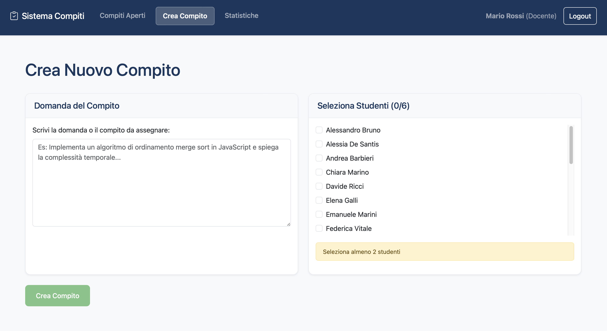

[](https://classroom.github.com/a/F9jR7G97)

# Exam #2: "Compiti"

## Student: s339129 Bonamico Carola

## React Client Application Routes

- `/login` — Authentication page (public)
- `/` — Redirects to `/assignments` if authenticated, or to `/login` if not authenticated
- `/assignments` — Open assignments list for answer submission (students) or evaluation (teachers) (protected)
- `/assignments/new` — Create new assignment with live constraint validation (teachers only) (protected)
- `/statistics` — Student statistics with sortable data (teachers only) (protected)
- `/my/scores` — Student's closed assignments and weighted average (students only) (protected)
- `*` — Any other route redirects to `/assignments` if authenticated, or to `/login` if not authenticated

## API Server

### POST `/api/sessions`

Login, create user session

- **Request Body:**
  ```json
  {
    "username": "string (email)",
    "password": "string"
  }
  ```
- **Response Body:**
  ```json
  {
    "id": "integer",
    "username": "string",
    "name": "string",
    "role": "teacher|student"
  }
  ```
- **Success Codes:**
  - `200 OK`: login successful
- **Error Codes:**
  - `401 Unauthorized`: invalid credentials
  - `500 Internal Server Error`: server/database error

### GET `/api/sessions/current`

Get authenticated user

- **Response Body:**
  ```json
  {
    "id": "integer",
    "username": "string",
    "name": "string",
    "role": "teacher|student"
  }
  ```
- **Success Codes:**
  - `200 OK`: user data retrieved successfully
- **Error Codes:**
  - `401 Unauthorized`: not authenticated
  - `500 Internal Server Error`: server/database error

### DELETE `/api/sessions/current`

Logout

- **Response Body:** (empty)
- **Success Codes:**
  - `200 OK`: logout successful
- **Error Codes:**
  - `500 Internal Server Error`: server/database error

### GET `/api/students`

List all students

- **Response Body:**
  ```json
  [
    { "id": "integer", "name": "string", "email": "string", "role": "student" },
    ...
  ]
  ```
- **Success Codes:**
  - `200 OK`: students list retrieved successfully
- **Error Codes:**
  - `401 Unauthorized`: not authenticated
  - `500 Internal Server Error`: server/database error

### GET `/api/assignments/open`

Get open assignments filtered by user role

- **Response Body:**
  ```json
  [
    {
      "id": "integer",
      "question": "string",
      "teacher_id": "integer",
      "teacher_name": "string",
      "status": "open",
      "answer": "string|null",
      "score": "null",
      "groupSize": "integer"
    },
    ...
  ]
  ```
- **Success Codes:**
  - `200 OK`: assignments retrieved successfully
- **Error Codes:**
  - `401 Unauthorized`: not authenticated
  - `500 Internal Server Error`: server/database error

### POST `/api/groups/validate`

Check group constraints before assignment creation (teachers only)

- **Request Body:**
  ```json
  {
    "studentIds": [ "integer", ... ]
  }
  ```
- **Response Body:**
  ```json
  {
    "isValid": "boolean",
    "error": "string|null"
  }
  ```
- **Success Codes:**
  - `200 OK`: validation completed successfully
- **Error Codes:**
  - `401 Unauthorized`: not authenticated
  - `403 Forbidden`: not a teacher
  - `400 Bad Request`: invalid student IDs array (must be 2-6 students)
  - `500 Internal Server Error`: server/database error

### POST `/api/assignments`

Create new assignment (teachers only)

- **Request Body:**
  ```json
  {
    "question": "string",
    "studentIds": [ "integer", ... ]
  }
  ```
- **Response Body:**
  ```json
  {
    "id": "integer"
  }
  ```
- **Success Codes:**
  - `201 Created`: assignment created successfully
- **Error Codes:**
  - `401 Unauthorized`: not authenticated
  - `403 Forbidden`: not a teacher
  - `400 Bad Request`: missing/invalid fields or validation errors (2-6 students required)
  - `500 Internal Server Error`: server/database error

### PUT `/api/assignments/:id/answer`

Submit answer (students only)

- **Parameters:**
  - `:id` — Assignment ID (integer, required)
- **Request Body:**
  ```json
  {
    "answer": "string"
  }
  ```
- **Response Body:**
  ```json
  {
    "id": "integer",
    "message": "Answer submitted successfully"
  }
  ```
- **Success Codes:**
  - `200 OK`: answer submitted successfully
- **Error Codes:**
  - `401 Unauthorized`: not authenticated
  - `403 Forbidden`: not a student
  - `400 Bad Request`: empty/invalid answer, assignment not open
  - `500 Internal Server Error`: server/database error

### PUT `/api/assignments/:id/evaluate`

Evaluate assignment (teachers only)

- **Parameters:**
  - `:id` — Assignment ID (integer, required)
- **Request Body:**
  ```json
  {
    "score": "integer (0-30)"
  }
  ```
- **Response Body:**
  ```json
  {
    "id": "integer",
    "score": "integer",
    "status": "closed",
    "message": "Assignment evaluated successfully"
  }
  ```
- **Success Codes:**
  - `200 OK`: assignment evaluated successfully
- **Error Codes:**
  - `401 Unauthorized`: not authenticated
  - `403 Forbidden`: not a teacher
  - `400 Bad Request`: invalid score, assignment not open
  - `500 Internal Server Error`: server/database error

### GET `/api/assignments/closed-with-average`

Get student's closed assignments and weighted average (students only)

- **Response Body:**
  ```json
  {
    "assignments": [
      {
        "id": "integer",
        "question": "string",
        "teacher_id": "integer",
        "teacher_name": "string",
        "status": "closed",
        "answer": "string",
        "score": "integer",
        "groupSize": "integer"
      },
      ...
    ],
    "weightedAverage": "number|null"
  }
  ```
- **Success Codes:**
  - `200 OK`: data retrieved successfully
- **Error Codes:**
  - `401 Unauthorized`: not authenticated
  - `403 Forbidden`: not a student
  - `500 Internal Server Error`: server/database error

### GET `/api/students/statistics`

Student statistics for teacher's assigned tasks (teachers only)

- **Response Body:**
  ```json
  [
    {
      "id": "integer",
      "name": "string",
      "open_assignments": "integer",
      "closed_assignments": "integer",
      "total_assignments": "integer",
      "weighted_average": "number|null"
    },
    ...
  ]
  ```
- **Success Codes:**
  - `200 OK`: statistics retrieved successfully
- **Error Codes:**
  - `401 Unauthorized`: not authenticated
  - `403 Forbidden`: not a teacher
  - `500 Internal Server Error`: server/database error

## Database Tables

| Table Name        | Main Columns & Types                                                                           | Purpose/Description                                |
| ----------------- | ---------------------------------------------------------------------------------------------- | -------------------------------------------------- |
| users             | id (int, PK), name (text), email (text, unique), password (text), salt (text), role (text)     | Stores all users (students and teachers)           |
| assignments       | id (int, PK), question (text), teacher_id (int, FK), status (text), answer (text), score (int) | Stores assignments with metadata and status        |
| assignment_groups | assignment_id (int, FK), student_id (int, FK), PK (assignment_id, student_id)                  | Links assignments to student groups (many-to-many) |

(PK = Primary Key, FK = Foreign Key)

## Main React Components

### Components

- `Navigation.jsx`: navigation bar with role-based menu and logout functionality
- `LoginForm.jsx`: authentication form with validation and error handling
- `LoadingSpinner.jsx`: reusable loading indicator component
- `QuestionFormCard.jsx`: card component for assignment question input
- `StudentSelectionCard.jsx`: component for student selection with real-time constraint validation
- `AssignmentCard.jsx`: modular card component for assignment display and interaction
- `StudentAverageCard.jsx`: component displaying student's weighted average score
- `ClosedAssignmentTable.jsx`: table component for displaying closed assignments
- `ClosedAssignmentRow.jsx`: row component for closed assignment display
- `StatsTable.jsx`: table component for student statistics display
- `StatsSortFilter.jsx`: sorting and filtering controls for statistics
- `StudentStatsRow.jsx`: row component for student statistics display

### Pages

- `OpenAssignments.jsx`: displays open assignments for answer submission (students) or evaluation (teachers)
- `CreateAssignment.jsx`: assignment creation with live constraint validation and real-time feedback (teachers only)
- `Statistics.jsx`: comprehensive student statistics with sorting capabilities (teachers only)
- `MyScores.jsx`: displays student's closed assignments and weighted average across all teachers (students only)

## Screenshots



*Assignment creation page*


*Student statistics with sortable data*

## Users Credentials

| Username                             | Password    | Role    | Name                |
| ------------------------------------ | ----------- | ------- | ------------------- |
| mario.rossi@polito.it                | password123 | teacher | Prof. Mario Rossi   |
| anna.verdi@polito.it                 | password456 | teacher | Prof.ssa Anna Verdi |
| giulia.bianchi@studenti.polito.it    | student123  | student | Giulia Bianchi      |
| marco.ferrari@studenti.polito.it     | student123  | student | Marco Ferrari       |
| laura.russo@studenti.polito.it       | student123  | student | Laura Russo         |
| alessandro.bruno@studenti.polito.it  | student123  | student | Alessandro Bruno    |
| francesca.romano@studenti.polito.it  | student123  | student | Francesca Romano    |
| davide.ricci@studenti.polito.it      | student123  | student | Davide Ricci        |
| chiara.marino@studenti.polito.it     | student123  | student | Chiara Marino       |
| luca.greco@studenti.polito.it        | student123  | student | Luca Greco          |
| valentina.conti@studenti.polito.it   | student123  | student | Valentina Conti     |
| simone.deluca@studenti.polito.it     | student123  | student | Simone De Luca      |
| elena.galli@studenti.polito.it       | student123  | student | Elena Galli         |
| matteo.lombardi@studenti.polito.it   | student123  | student | Matteo Lombardi     |
| sara.moretti@studenti.polito.it      | student123  | student | Sara Moretti        |
| andrea.barbieri@studenti.polito.it   | student123  | student | Andrea Barbieri     |
| martina.fontana@studenti.polito.it   | student123  | student | Martina Fontana     |
| riccardo.serra@studenti.polito.it    | student123  | student | Riccardo Serra      |
| federica.vitale@studenti.polito.it   | student123  | student | Federica Vitale     |
| nicola.pellegrini@studenti.polito.it | student123  | student | Nicola Pellegrini   |
| roberta.caruso@studenti.polito.it    | student123  | student | Roberta Caruso      |
| stefano.fiore@studenti.polito.it     | student123  | student | Stefano Fiore       |
| alessia.desantis@studenti.polito.it  | student123  | student | Alessia De Santis   |
| emanuele.marini@studenti.polito.it   | student123  | student | Emanuele Marini     |
